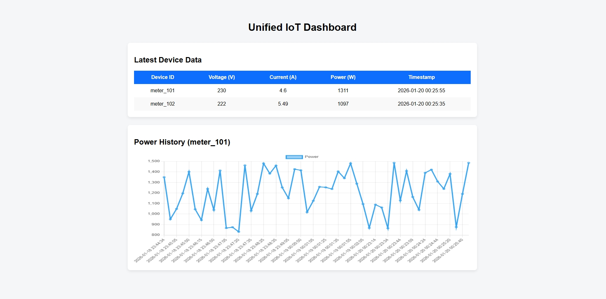

# Unified IoT Dashboard

## 📌 Project Overview
The Unified IoT Dashboard is a full-stack web application designed to collect, store, and visualize real-time IoT device data. The system demonstrates an end-to-end IoT data pipeline starting from MQTT-based data ingestion to backend processing, database storage, REST APIs, and frontend visualization.

This project was developed as part of a **Software Intern Technical Assignment** to showcase skills in backend development, API design, database management, MQTT integration, and frontend dashboard creation.

---

## 🧠 System Architecture

```
MQTT Publisher (Simulated IoT Device)
        ↓
MQTT Broker (Mosquitto)
        ↓
Backend (FastAPI + MQTT Client)
        ↓
Database (SQLite + SQLAlchemy)
        ↓
REST APIs
        ↓
Frontend Dashboard (HTML + CSS + JavaScript + Chart.js)
```

---

## 🛠️ Technology Stack

### Backend
- **Python 3.10+**
- **FastAPI** – REST API framework
- **SQLAlchemy** – ORM for database management
- **SQLite** – Lightweight database
- **paho-mqtt** – MQTT client
- **Uvicorn** – ASGI server

### Frontend
- **HTML5**
- **CSS3**
- **JavaScript (Vanilla JS)**
- **Chart.js** – Data visualization

### IoT / Messaging
- **MQTT Protocol**
- **Mosquitto Broker**

---

## 📂 Project Structure

```
iot-dashboard/
│
├── backend/
│   ├── main.py              # FastAPI app & APIs
│   ├── models.py            # Database models
│   ├── database.py          # DB configuration
│   ├── mqtt_listener.py     # MQTT subscriber
│   └── requirements.txt
│
├── frontend/
│   ├── index.html           # Dashboard UI
│   ├── style.css            # Styling
│   └── app.js               # API calls & charts
│
└── README.md
```

---

## 📡 MQTT Data Format (Sample)

```json
{
  "device_id": "meter_101",
  "voltage": 230,
  "current": 4.5,
  "power": 1035,
  "timestamp": "2026-01-20 00:25:20"
}
```

---

## 🔗 API Endpoints

### 1️⃣ Get Latest Data for All Devices
```
GET /latest-data
```
**Response:**
```json
[
  {
    "device_id": "meter_101",
    "voltage": 231,
    "current": 4.83,
    "power": 1381,
    "timestamp": "2026-01-20 00:25:20"
  }
]
```

---

### 2️⃣ Get Power History for a Device
```
GET /device/{device_id}/history
```
**Response:**
```json
[
  {
    "power": 1200,
    "timestamp": "2026-01-20 00:24:50"
  }
]
```

---

## ▶️ How to Run the Project

### 1️⃣ Start MQTT Broker
```
mosquitto
```

### 2️⃣ Start Backend Server
```
cd backend
pip install -r requirements.txt
uvicorn main:app --reload
```

Backend will run at:
```
http://127.0.0.1:8000
```

### 3️⃣ Start MQTT Listener
```
python mqtt_listener.py
```

### 4️⃣ Open Frontend
Open `frontend/index.html` in a browser.

---

## 📸 Dashboard Screenshot

> Below is a sample screenshot of the Unified IoT Dashboard showing live device data and power history visualization.



---

## 📊 Features Implemented
- Real-time IoT data ingestion via MQTT
- Automatic device registration
- Persistent data storage in database
- REST APIs for latest and historical data
- Live dashboard with table and power history chart
- Clean and responsive UI

---

## 🚀 Future Enhancements
- Device selection dropdown
- Authentication & role-based access
- Alerts for threshold breaches
- Deployment using Docker & Cloud services

---

## 👨‍💻 Author
**Piyush Pal**  
Computer Science Engineer  

---

## ✅ Conclusion
This project demonstrates a scalable and modular IoT dashboard framework capable of integrating multiple devices and use cases. It fulfills all the functional and technical requirements of the assignment, showcasing both backend and frontend development expertise.

